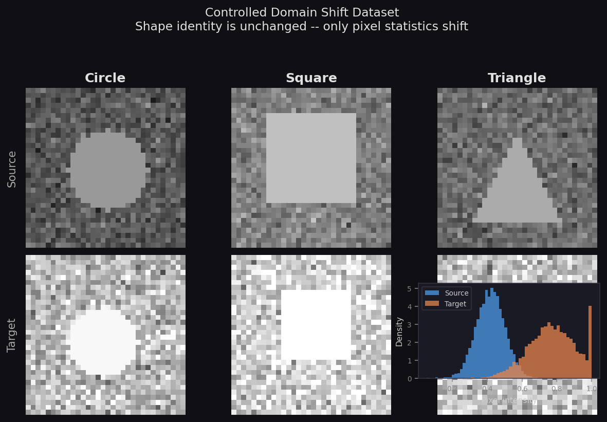
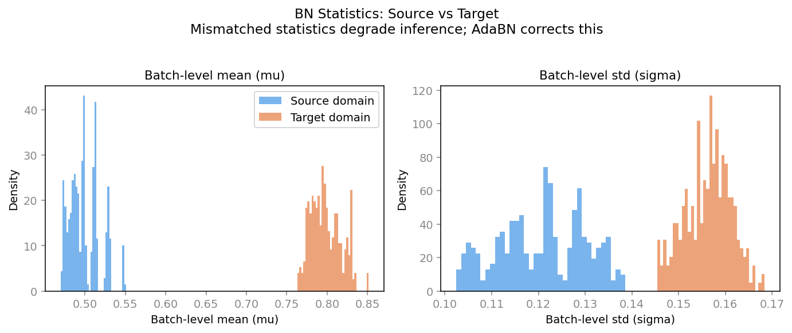

# AdaBN Control Dataset

Control dataset for testing the Batch Normalisation statistics domain-shift property.

Based on: <br>
Li et al., *Revisiting Batch Normalisation for Practical Domain Adaptation* — [arXiv:1603.04779](https://arxiv.org/abs/1603.04779)  
Wang et al., *Tent: Fully Test-Time Adaptation by Entropy Minimisation* — [arXiv:2006.10726](https://arxiv.org/abs/2006.10726)


## Table of Contents

1. [Overview](#overview)
2. [Motivation & Tested Property](#motivation--tested-property)
3. [Dataset Description](#dataset-description)
4. [Controlled Factors](#controlled-factors)
5. [Repository Structure](#repository-structure)
6. [Quick Start](#quick-start)
7. [Generation Method](#generation-method)
8. [Expected Experimental Outcomes](#expected-experimental-outcomes)
9. [Limitations](#limitations)


## Overview

This repository provides a minimal, fully controlled image dataset for empirically testing a central hypothesis motivating AdaBN (Li et al., 2017):

Label-related knowledge is stored in the weight matrices of each layer, whereas domain-related information is reflected in Batch Normalisation statistics. The per-channel running mean μ and variance σ² accumulated from the training data.

The dataset is designed so that exactly one confounder varies between the source and target domains: the pixel intensity statistics (μ, σ). Shape geometry, class labels, image resolution, and spatial layout are all held constant. This allows a clean, controlled test of whether mismatching BN statistics alone is sufficient to degrade accuracy and whether correcting them (AdaBN) recovers it.

The dataset is produced for AdaBN which can be used as a test-time normalisation baseline.


## Motivation & Tested Property

### Background: Batch Normalisation and domain shift

Batch Normalisation stabilises deep network training by keeping the input distribution of each layer approximately standard-Gaussian. It does so by storing running statistics (mean μ and variance σ²) computed from the training data, and using those statistics at test time to normalise activations.

When training data (source domain) and test data (target domain) come from different distributions (different cameras, sensors, or lighting conditions) those stored statistics become mismatched to the incoming target activations at every layer of the network. This is the mechanism AdaBN identifies as the primary cause of accuracy degradation under domain shift.

### The property this dataset tests

| | |
|---|---|
| Property | Domain-specific information is reflected in BN statistics (μ, σ²). Mismatched source statistics contribute to domain shift, while re-estimating target statistics can reduce this mismatch. |
| Single confounder | Pixel intensity distribution (μ_bg, σ_bg) only. All other factors are identical across domains. |
| Control | Source-trained model on source test images → high accuracy. |
| Problem | Source-trained model on target images (source BN stats) → degraded accuracy. |
| Fix | Re-estimate BN stats from unlabelled target images (AdaBN) → accuracy recovered. |

### Connection to AdaBN

The motivation comes directly from the pilot experiment in AdaBN (Section 3.1, Figure 2), where Batch Normalisation statistics collected from different domains form clearly separable clusters. This observation suggests that BN statistics capture domain-specific characteristics. AdaBN therefore adapts a network by replacing source-domain BN statistics with statistics computed from the target domain while keeping the learned weights fixed.

### Why this matters for Tent

Tent (Wang et al., 2021) extends AdaBN by additionally optimising the BN affine parameters (γ, β) via entropy minimisation, on top of re-estimating (μ, σ²). Understanding why re-estimating the statistics alone already helps, and by how much, is essential groundwork for understanding the motivation and incremental contribution of Tent. The controlled setting here isolates that step precisely.

### Goal of the Control Dataset

The goal of this control dataset is to isolate the specific mechanism targeted by AdaBN: the mismatch between source-domain and target-domain Batch Normalisation statistics.

Within the FRMDL control-dataset framework, the dataset is designed to evaluate whether:

- a controlled intensity-based domain shift is a reasonable approximation of a real distribution shift (c1),
- a standard BN-equipped CNN provides a reasonable baseline (c2),
- mismatched BN statistics produce measurable performance degradation (c3), and
- re-estimating BN statistics via AdaBN alleviates this degradation (c4).

By keeping classes, labels, geometry, and class frequencies fixed while varying only image intensity statistics, the dataset provides a direct test of AdaBN's central adaptation mechanism.


## Dataset Description

| Property | Value |
|---|---|
| Total images | 6000 |
| Image size | 32 × 32 pixels, single channel (greyscale) |
| Classes | Circle, Square, Triangle |
| Domains | Source · Target |
| Images per class per domain | 1000 |
| Random seed | 42 (`numpy.random.default_rng(42)`) |
| Format | 8-bit greyscale PNG |

### Dataset Design

The dataset is intentionally designed to isolate a single form of domain shift.

The source and target domains contain:

- identical classes
- identical labels
- identical geometric shapes
- identical image resolution
- identical class frequencies

The only systematic difference between domains is the image intensity distribution.

This design directly targets the AdaBN hypothesis that domain-specific information is reflected in Batch Normalisation statistics.

### Pixel Intensity Parameters

| Domain | Class | μ_bg | σ_bg |
|---|---|---|---|
| Source | Circle | 0.45 | 0.08 |
| Source | Square | 0.45 | 0.08 |
| Source | Triangle | 0.45 | 0.08 |
| Target | Circle | 0.75 | 0.14 |
| Target | Square | 0.75 | 0.14 |
| Target | Triangle | 0.75 | 0.14 |

All classes share identical statistics within a domain.

This prevents brightness from leaking class information and ensures that shape remains the only label-related signal.

### Dataset Statistics

The generated dataset was validated using `validate_dataset.py`.

#### Global Statistics

| Statistic | Source | Target |
|---|---:|---:|
| Images | 3000 | 3000 |
| Mean intensity | 0.4980 | 0.7968 |
| Standard deviation | 0.1229 | 0.1582 |

#### Measured Domain Shift

| Metric | Difference |
|---|---:|
| Mean shift | +0.2988 |
| Standard deviation shift | +0.0353 |

#### Class Distribution

| Class | Source | Target |
|---|---:|---:|
| Circle | 1000 | 1000 |
| Square | 1000 | 1000 |
| Triangle | 1000 | 1000 |

The class distribution is perfectly balanced across domains.

### Domain shift visualisation

*Source (top row) versus target (bottom row). Shape identity is unchanged while image intensity statistics shift substantially.*



### BN Statistics Comparison

*Simulated Batch Normalisation statistics showing the separation between source and target distributions. AdaBN addresses this mismatch by replacing source-domain BN statistics with target-domain statistics.*




## Controlled Factors

A control dataset isolates one specific property while holding all other factors constant. In this dataset:

| Factor | Controlled? |
|----------|----------|
| Class labels | Yes |
| Shape geometry | Yes |
| Class frequencies | Yes |
| Resolution | Yes |
| Foreground contrast | Yes |
| Mean intensity (μ_bg) | No — varies by domain |
| Variance (σ_bg²) | No — varies by domain |

The source and target domains differ only in image intensity statistics. Any performance degradation therefore cannot be attributed to changes in semantics, class identity, geometry, or dataset composition. This allows a direct test of the AdaBN hypothesis that mismatched BN statistics contribute to domain shift.


## Repository Structure

```text
FRMDL-AdaBN-Control-Dataset/
│
├── README.md
├── generate_dataset.py
├── validate_dataset.py
├── generate_validation_plots.py
├── metadata.json
│
├── source/
│   ├── class_0_circle/
│   ├── class_1_square/
│   └── class_2_triangle/
│
├── target/
│   ├── class_0_circle/
│   ├── class_1_square/
│   └── class_2_triangle/
│
└── figures/
    ├── domain_shift_vis.png
    ├── bn_stats_vis.png
    ├── dataset_histograms.png
    └── dataset_statistics.png
```


## Quick Start

### Generate the dataset from scratch

```bash
# 1. Clone the repository
git clone https://github.com/riyagupta0701/FRMDL-AdaBN-Control-Dataset.git

# 2. Install dependencies (no GPU required)
pip install numpy pillow matplotlib

# 3. Generate all images and figures
python generate_dataset.py
```

This writes 6000 PNG images to `source/` and `target/`, generates the two
diagnostic figures (`domain_shift_vis.png`, `bn_stats_vis.png`) to `figures/`,
and writes `metadata.json`.

```bash
# 4. (Optional) Validate the generated dataset statistics
python validate_dataset.py

# 5. (Optional) Generate additional histogram and statistics plots
python generate_validation_plots.py
```

### Load with PyTorch (example)

```python
from torchvision.datasets import ImageFolder
from torchvision import transforms

transform = transforms.Compose([
    transforms.Grayscale(),
    transforms.ToTensor(),          # → [0, 1] float32, shape (1, 32, 32)
])

source_dataset = ImageFolder('source/', transform=transform)
target_dataset = ImageFolder('target/', transform=transform)

# Class mapping: {0: 'class_0_circle', 1: 'class_1_square', 2: 'class_2_triangle'}
print(source_dataset.class_to_idx)
```

### Load with NumPy (no framework required)

```python
import numpy as np
from PIL import Image
from pathlib import Path

def load_domain(domain: str):
    """Returns (images, labels) arrays for a domain."""
    root   = Path(domain)
    images, labels = [], []
    for label_idx, cls_dir in enumerate(sorted(root.iterdir())):
        for img_path in sorted(cls_dir.glob('*.png')):
            img = np.array(Image.open(img_path)) / 255.0   # float32 in [0, 1]
            images.append(img)
            labels.append(label_idx)
    return np.stack(images), np.array(labels)

X_src, y_src = load_domain('source')   # shape (3000, 32, 32)
X_tgt, y_tgt = load_domain('target')   # shape (3000, 32, 32)
print(X_src.shape, y_src.shape)
```


## Generation Method

Each image is produced by the following three-step procedure:

**Step 1: Background**  
A 32×32 float array is sampled pixel-wise from N(μ_bg, σ_bg), clipped to [0, 1]. The parameters (μ_bg, σ_bg) are the only quantity that differs between source and target domains.

**Step 2: Shape**  
A foreground intensity is set to min(μ_bg + 0.25, 1). The geometric shape (determined by the class label) is rasterised at a randomised scale (radius ≈ 22–32% of image width) with a small random centre jitter (±8% of image width) to prevent the model exploiting a fixed spatial prior.

**Step 3: Quantise and save**  
The float array is scaled to [0, 255], cast to uint8, and saved as a greyscale PNG.

**Design rationale:** The +0.25 foreground offset is applied in both domains, so the relative contrast of shape versus background is preserved across domains. The shape is always visible, but the absolute intensity of both foreground and background shifts together with μ_bg. The only systematic cue available for domain discrimination is the image intensity distribution. Since all classes share identical statistics within a domain, shape remains the only label-related signal while intensity statistics become the only domain-related signal.


## Expected Experimental Outcomes

### Source-Domain Performance

A standard CNN equipped with Batch Normalisation should achieve high accuracy on source-domain test data, demonstrating that the classification task is straightforward and that the baseline model can successfully learn the shape categories.

Expected result:

> Source-domain accuracy should be high (typically above 95%).

### Effect of Domain Shift

When evaluated on the target domain, the source-trained model continues using Batch Normalisation statistics estimated from the source distribution.

Because the target domain has substantially different intensity statistics, these stored statistics become mismatched to the incoming activations.

Expected result:

> Target-domain accuracy should decrease relative to source-domain accuracy.

This behaviour corresponds to the domain-shift problem identified by AdaBN.

### Effect of AdaBN

AdaBN replaces the source-domain Batch Normalisation statistics with statistics computed from unlabelled target-domain samples while keeping all learned weights fixed.

Expected result:

> Target-domain accuracy after AdaBN should be higher than target-domain accuracy before adaptation.

Recovery does not need to be perfect; however, a substantial improvement would support the AdaBN hypothesis that correcting BN statistics reduces domain shift.

### Connection to Tent

Tent extends AdaBN by not only re-estimating Batch Normalisation statistics (μ, σ²), but also adapting the affine Batch Normalisation parameters (γ, β) through entropy minimisation.

Any remaining performance gap after AdaBN adaptation therefore motivates the additional optimisation performed by Tent.


## Limitations

This dataset intentionally models a simplified form of domain shift. The source and target domains differ only in image intensity statistics. Real-world domain adaptation problems may additionally involve changes in texture, viewpoint, background, sensor characteristics, object appearance, or class frequencies. Consequently, the dataset evaluates a specific mechanism proposed by AdaBN rather than all forms of domain shift.
