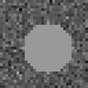
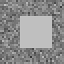
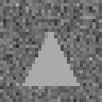
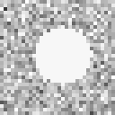
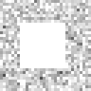
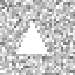
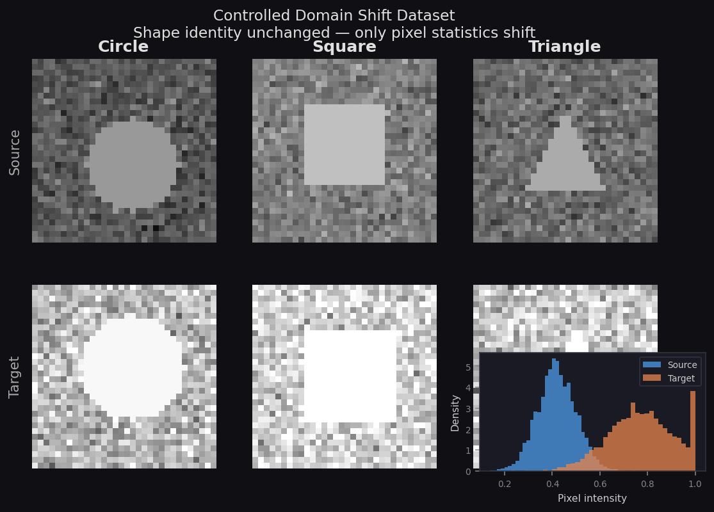
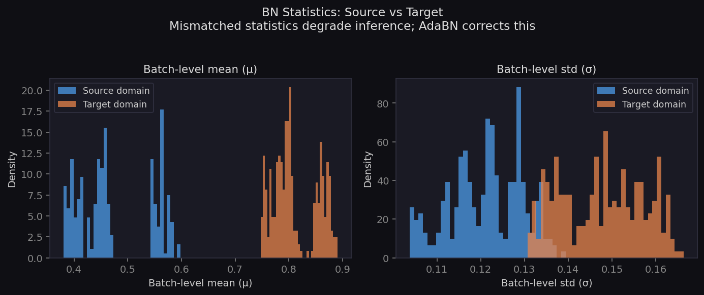

# AdaBN Control Dataset

> **Controlled dataset for testing the Batch Normalisation statistics domain-shift property**  
> Related paper: Li et al., *Revisiting Batch Normalisation for Practical Domain Adaptation* — [arXiv:1603.04779](https://arxiv.org/abs/1603.04779)  
> Reproduction target: Wang et al., *Tent: Fully Test-Time Adaptation by Entropy Minimisation* — [arXiv:2006.10726](https://arxiv.org/abs/2006.10726)

---

## Table of Contents

1. [Overview](#overview)
2. [Motivation & Tested Property](#motivation--tested-property)
3. [Dataset Description](#dataset-description)
4. [Repository Structure](#repository-structure)
5. [Quick Start](#quick-start)
6. [Generation Method](#generation-method)
7. [Expected Experimental Outcomes](#expected-experimental-outcomes)
8. [Requirements](#requirements)

---

## Overview

This repository provides a **minimal, fully controlled** image dataset for empirically
testing the central claim of AdaBN (Li et al., 2017):

> *Label-related knowledge is stored in the weight matrices of each layer, whereas
> domain-related knowledge is encoded in the Batch Normalisation statistics — the
> per-channel running mean μ and variance σ² accumulated from the training data.*

The dataset is designed so that **exactly one confounder** varies between the source
and target domains: the pixel intensity statistics (μ, σ). Shape geometry, class
labels, image resolution, and spatial layout are all held constant. This allows a
clean, controlled test of whether mismatching BN statistics alone is sufficient to
degrade accuracy — and whether correcting them (AdaBN) recovers it.

The dataset is produced as part of a reproduction study of
[Tent (arXiv:2006.10726)](https://arxiv.org/abs/2006.10726), for which AdaBN is the
primary test-time normalisation baseline.

---

## Motivation & Tested Property

### Background: Batch Normalisation and domain shift

Batch Normalisation (Ioffe & Szegedy, 2015 — [arXiv:1502.03167](https://arxiv.org/abs/1502.03167))
stabilises deep network training by keeping the input distribution of each layer
approximately standard-Gaussian. It does so by storing **running statistics**
(mean μ and variance σ²) computed from the training data, and using those statistics
at test time to normalise activations.

When training data (source domain) and test data (target domain) come from different
distributions — different cameras, sensors, or lighting conditions — those stored
statistics become **mismatched** to the incoming target activations at every layer of
the network. This is the mechanism AdaBN identifies as the primary cause of
accuracy degradation under domain shift.

### The property this dataset tests

| | |
|---|---|
| **Property** | BN statistics (μ, σ²) encode domain identity. Mismatching them at test time degrades accuracy; correcting them restores it. |
| **Single confounder** | Pixel intensity distribution (μ_bg, σ_bg) only. All other factors are identical across domains. |
| **Control** | Source-trained model on source test images → high accuracy. |
| **Problem** | Source-trained model on target images (source BN stats) → degraded accuracy. |
| **Fix** | Re-estimate BN stats from unlabelled target images (AdaBN) → accuracy recovered. |

### Why this matters for Tent

Tent (Wang et al., 2021) extends AdaBN by additionally **optimising** the BN affine
parameters (γ, β) via entropy minimisation — on top of re-estimating (μ, σ²).
Understanding why re-estimating the statistics alone already helps, and by how much,
is essential groundwork for understanding the motivation and incremental contribution
of Tent. The controlled setting here isolates that step precisely.

---

## Dataset Description

| Property | Value |
|---|---|
| Total images | 1,200 |
| Image size | 32 × 32 pixels, single channel (greyscale) |
| Classes | Circle, Square, Triangle |
| Domains | Source (darker, low variance) · Target (brighter, high variance) |
| Images per class per domain | 200 |
| Random seed | 42 (`numpy.random.default_rng(42)`) |
| Format | 8-bit greyscale PNG |

### Pixel intensity parameters

| Domain | Class | μ_bg | σ_bg |
|---|---|---|---|
| **Source** | Circle | 0.35 | 0.08 |
| **Source** | Square | 0.50 | 0.08 |
| **Source** | Triangle | 0.42 | 0.08 |
| **Target** | Circle | 0.72 | 0.14 |
| **Target** | Square | 0.82 | 0.14 |
| **Target** | Triangle | 0.77 | 0.14 |

The domain shift magnitude is **Cohen's d ≈ 4.4** (Δμ ≈ 0.35 relative to σ = 0.08),
ensuring near-zero overlap between source and target intensity distributions. This
guarantees that a classifier relying on source BN statistics will be measurably
degraded on target data.

```
Cohen's d  =  (μ_target − μ_source) / σ_source
           =  (0.77 − 0.42) / 0.08
           =  4.375   →   near-zero overlap between domains
```

### Example images

**Source domain** — darker, lower variance

| Circle (μ=0.35, σ=0.08) | Square (μ=0.50, σ=0.08) | Triangle (μ=0.42, σ=0.08) |
|:---:|:---:|:---:|
|  |  |  |

**Target domain** — brighter, higher variance

| Circle (μ=0.72, σ=0.14) | Square (μ=0.82, σ=0.14) | Triangle (μ=0.77, σ=0.14) |
|:---:|:---:|:---:|
|  |  |  |

### Domain shift visualisation



*Source (top row) vs target (bottom row). The inset histogram shows the marginal
pixel intensity distribution for each domain — source (blue) is narrower and darker;
target (orange) is broader and brighter. Shape geometry is identical in both domains.*

### BN statistics comparison



*Simulated Batch Normalisation statistics. **Left:** per-image pixel means are
clearly separated between domains. **Right:** the same for per-image standard
deviation. These are the statistics (μ, σ) stored by BN layers during training
(source) and re-estimated by AdaBN at test time (target). Mismatching them causes
incorrectly scaled activations at every layer.*

---

## Repository Structure

```
adabn-control-dataset/
│
├── README.md                    ← this file
│
├── generate_dataset.py      ← full dataset generation script
│
├── source/                      ← source domain (600 images)
│   ├── class_0_circle/
│   │   ├── img_0000.png
│   │   └── ... (200 images)
│   ├── class_1_square/
│   │   └── ... (200 images)
│   └── class_2_triangle/
│       └── ... (200 images)
│
├── target/                      ← target domain (600 images)
│   ├── class_0_circle/
│   ├── class_1_square/
│   └── class_2_triangle/
│
├── figures/
│   ├── domain_shift_vis.png     ← Figure 1: side-by-side domain comparison
│   ├── bn_stats_comparison.png  ← Figure 2: BN statistics histograms
│   ├── source_circle.png        ← example images (used in README)
│   ├── source_square.png
│   ├── source_triangle.png
│   ├── target_circle.png
│   ├── target_square.png
│   └── target_triangle.png
│
└── metadata.json                ← full generation parameters + sample manifest
```

---

## Quick Start

### Generate the dataset from scratch

```bash
# 1. Clone the repository
git clone https://github.com/YOUR_USERNAME/adabn-control-dataset
cd adabn-controlled-dataset

# 2. Install dependencies (no GPU required)
pip install numpy pillow matplotlib

# 3. Generate all images and figures
python generate_dataset.py
```

This writes 1,200 PNG images to `source/` and `target/`, generates the two
diagnostic figures to `figures/`, and writes `metadata.json`.

### Download the pre-generated dataset

A pre-generated zip archive is available on the
[Releases page](https://github.com/YOUR_USERNAME/adabn-controlled-dataset/releases):

```bash
wget https://github.com/YOUR_USERNAME/adabn-controlled-dataset/releases/download/v1.0/adabn_dataset.zip
unzip adabn_dataset.zip
```

### Load with PyTorch (example)

```python
from torchvision.datasets import ImageFolder
from torchvision import transforms

transform = transforms.Compose([
    transforms.Grayscale(),
    transforms.ToTensor(),          # → [0, 1] float32, shape (1, 32, 32)
])

source_dataset = ImageFolder('source/', transform=transform)
target_dataset = ImageFolder('target/', transform=transform)

# Class mapping: {0: 'class_0_circle', 1: 'class_1_square', 2: 'class_2_triangle'}
print(source_dataset.class_to_idx)
```

### Load with NumPy (no framework required)

```python
import numpy as np
from PIL import Image
from pathlib import Path

def load_domain(domain: str):
    """Returns (images, labels) arrays for a domain."""
    root   = Path(domain)
    images, labels = [], []
    for label_idx, cls_dir in enumerate(sorted(root.iterdir())):
        for img_path in sorted(cls_dir.glob('*.png')):
            img = np.array(Image.open(img_path)) / 255.0   # float32 in [0, 1]
            images.append(img)
            labels.append(label_idx)
    return np.stack(images), np.array(labels)

X_src, y_src = load_domain('source')   # shape (600, 32, 32)
X_tgt, y_tgt = load_domain('target')   # shape (600, 32, 32)
print(X_src.shape, y_src.shape)        # (600, 32, 32) (600,)
```

---

## Generation Method

Each image is produced by the following three-step procedure:

**Step 1 — Background.**  
A 32×32 float array is sampled pixel-wise from N(μ_bg, σ_bg), clipped to [0, 1].
The parameters (μ_bg, σ_bg) are the **only** quantity that differs between source
and target domains.

**Step 2 — Shape.**  
A foreground intensity is set to min(μ_bg + 0.25, 1). The geometric shape
(determined by the class label) is rasterised at a randomised scale (radius ≈ 22–32%
of image width) with a small random centre jitter (±8% of image width) to prevent
the model exploiting a fixed spatial prior.

**Step 3 — Quantise and save.**  
The float array is scaled to [0, 255], cast to uint8, and saved as a greyscale PNG.

> **Design rationale:** The +0.25 foreground offset is applied in both domains, so
> the relative contrast of shape versus background is preserved across domains.
> The shape is always visible, but the absolute intensity of both foreground and
> background shifts together with μ_bg. The **only** cue available for domain
> discrimination is therefore the absolute intensity level — precisely the
> quantity encoded in BN statistics.

Full source code: [`code/generate_dataset.py`](code/generate_dataset.py)

---

## Expected Experimental Outcomes

The dataset directly supports the three controlled checks (c1/c2/c3) from the
AdaBN storyline:

### c1 — Baseline is reasonable

Train a small BN-equipped CNN on the source domain. It should achieve
**near-perfect accuracy (>95%)** on source test images, confirming the task is
learnable and the baseline is fairly represented.

### c2 — Baseline suffers from the problem

Apply the source-trained model to **target images without adapting BN statistics**.
Accuracy should degrade substantially — ideally near chance (33%) — because the
stored running statistics (μ ≈ 0.42, σ ≈ 0.08) mis-normalise activations whose
true distribution has μ ≈ 0.77, σ ≈ 0.14 at every layer.

### c3 — AdaBN addresses the problem

Re-estimate BN statistics (μ, σ²) from unlabelled target images via a single
forward pass (no labels required). Accuracy on target images should recover to
**near-source levels (>90%)**, confirming that the weight matrices correctly encode
shape identity — only the BN statistics were wrong.

> **Link to Tent:** Any residual accuracy gap after AdaBN correction can be attributed
> to mismatch in the affine parameters (γ, β) — directly motivating the Tent
> extension, which additionally optimises (γ, β) via entropy minimisation.

---

## Requirements

| Package | Version tested | Purpose |
|---|---|---|
| `numpy` | ≥ 1.24 | Array generation, random sampling |
| `Pillow` | ≥ 9.0 | PNG save/load |
| `matplotlib` | ≥ 3.7 | Diagnostic figures |

No GPU is required. The script runs in under 10 seconds on a standard laptop.

```bash
pip install numpy pillow matplotlib
```
